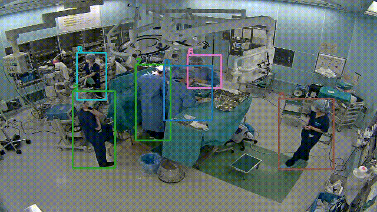

# Spatio-Temporal Unsupervised Individual Clustering for Operating Room Videos
The proposed model performs unsupervised activity classification for individuals captured in video frames. While there are numerous models that achieve high accuracy in activity classification using supervised learning, there is currently no model that accomplishes this task solely through unsupervised learning.

Real-world videos collected from smartphones or surveillance cameras often span long durations, making it challenging to clearly discern activities. Consequently, preparing accurate ground truth labels, as seen in research datasets, becomes difficult. This limitation prevents the use of supervised learning models.

However, our model overcomes this hurdle. By leveraging videos and individuals' bounding boxes, it achieves personalized activity classification without relying on labeled data. Specifically, we utilize bounding boxes detected during pose estimation within [this repository](https://github.com/kojikojiprg/pose_estimation).

Our proposed model consists of two autoencoders and clustering layer.


The result sample of our dataset.


# Environments
- Ubuntu: 20.04
- Python: 3.9.15
- CUDA: 12.0

# Dataset Structure
The dataset repository consists of train and test. Each folder contains an optional number of .mp4 files.

```
[dataset_dir]
├── test
│   ├── test_1.mp4
│   ...
│   └── test_n.mp4
│
└── train
    ├── train_1.mp4
    ...
    └── train_n.mp4
```

# Spatial Feature
The accuracy is enhanced by incorporating spatial features specific to the surgical environment which are crucial in recognizing human actions. Operating rooms exhibit distinct spatial characteristics, with individuals positioned around the operating table. For instance, surgeons and scrub nurses gather around the operating table, anesthetists are positioned along the patient’s head, and circulators move freely in and out of the operating room. As a simple feature, we manually specify the central coordinates of the operating tables and calculate the L2 norm between the centers of the individual’s bounding box and operating table.

## Usage
1. If you wand to use the spatial feature, please set the ```add_spatial_feature``` of ```clustering``` in the ```./configs/model_config.yaml``` to True.
2. Put the coordination of the center of the object like operating table into ```dataset_dir/[STAGE]/[VIDEO]/coor.npy```, where STAGE is selected from 'train' or 'test' and VIDEO denotes the file name of .mp4 videos.


# Setup
```
pip install -U pip
pip install -r requirements.txt --extra-index-url https://download.pytorch.org/whl/cu121
```

# Prepairing Bounding Boxes
We extract individual bounding boxs using [this repository](https://github.com/kojikojiprg/pose_estimation), which is used for our research projects.

# Optical Flow
Calcurate the oprtical flow from .mp4 videos.
The output file 'flow.npy' will be stored into the dataset directory.

```
python tools/optical_flow.py [-dt DATASET_TYPE] [--comp] dataset_dir
```

positional arguments:
  dataset_dir           path of input dataset directory

optional arguments:
  - --comp                compress output from float32 to float16.


# Training Models
## Training Autoencoders
Pre train the autoencoders. The checkpoints will be saved into ```./models/[DATASET_TYPE]/autoencoders/```.
```
Python tools/training_autoencoder.py [-dt DATASET_TYPE] [-mc MODEL_CONFIG_PATH] [--checkpoint_dir CHECKPOINT_DIR] [--log_dir LOG_DIR] [-g [GPUS ...]] dataset_dir datatype
```
positional arguments:
  - dataset_dir           The directory of dataset
  - datatype              Select from 'frame' or 'flow'.
    - 'frame' is for RGB frame of .mp4 videos.
    - 'flow' is for the optical flow calcurated by ```tools/optical_flow.py```.

optional arguments:
  - -dt DATASET_TYPE, --dataset_type DATASET_TYPE
  - -mc MODEL_CONFIG_PATH, --model_config_path MODEL_CONFIG_PATH
  - --checkpoint_dir CHECKPOINT_DIR
  - --log_dir LOG_DIR
  - -g [GPUS ...], --gpus [GPUS ...] gpu ids

## Training DeepClusteringModel
Train our proposed model. The checkpoints will be saved into ```./models/[DATASET_TYPE]/deep_clustering_model/```.
```
python tools/training.py [-dt DATASET_TYPE] [-v VERSION] [-mc MODEL_CONFIG_DIR] [--checkpoint_dir CHECKPOINT_DIR] [--log_dir LOG_DIR] [-g [GPUS ...]] dataset_dir
```

positional arguments:
  - dataset_dir

optional arguments:
  - -dt DATASET_TYPE, --dataset_type DATASET_TYPE
  - -v VERSION, --version VERSION
  - -mc MODEL_CONFIG_DIR, --model_config_dir MODEL_CONFIG_DIR
  - --checkpoint_dir CHECKPOINT_DIR
  - --log_dir LOG_DIR
  - -g [GPUS ...], --gpus [GPUS ...] gpu ids

# Prediction
Pred the clustering labels of individuals in the videos. The results will be saved into ```./out/[DATASET_TYPE]/v[VERSION]/```.
```
python tools/prediction.py [-dt DATASET_TYPE] [-v VERSION] [-mc MODEL_CONFIG_DIR] [--checkpoint_dir CHECKPOINT_DIR] [--log_dir LOG_DIR] [-g [GPUS ...]] dataset_dir stage
```

positional arguments:
  - dataset_dir
  - stage                 'train' or 'test'

optional arguments:
  - -dt DATASET_TYPE, --dataset_type DATASET_TYPE
  - -v VERSION, --version VERSION
  - -mc MODEL_CONFIG_DIR, --model_config_dir MODEL_CONFIG_DIR
  - --checkpoint_dir CHECKPOINT_DIR
  - --log_dir LOG_DIR
  - -g [GPUS ...], --gpus [GPUS ...] gpu ids

# Evaluation
Evaluate the accuracy of the model. This script calcurates and outputs the confusion matrices and accuracy scores. The results will be saved into ```./out/[DATASET_TYPE]/v[VERSION]/```.
```
python tools/evalutation.py [-dt DATASET_TYPE] [-mc MODEL_CONFIG_DIR] dataset_dir stage version
```

positional arguments:
  - dataset_dir
  - stage                 'train' or 'test'
  - version

optional arguments:
  - -dt DATASET_TYPE, --dataset_type DATASET_TYPE
  - -mc MODEL_CONFIG_DIR, --model_config_dir MODEL_CONFIG_DIR

# Reference
```

```
