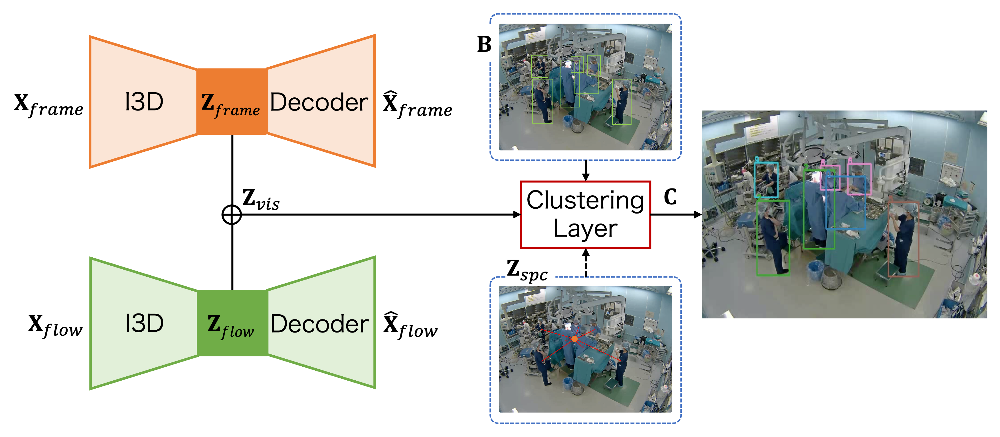

# Spatio-Temporal Unsupervised Individual Clustering for Operating Room Videos
The proposed model performs unsupervised activity classification for individuals captured in video frames. While there are numerous models that achieve high accuracy in activity classification using supervised learning, there is currently no model that accomplishes this task solely through unsupervised learning.

Real-world videos collected from smartphones or surveillance cameras often span long durations, making it challenging to clearly discern activities. Consequently, preparing accurate ground truth labels, as seen in research datasets, becomes difficult. This limitation prevents the use of supervised learning models.

However, our model overcomes this hurdle. By leveraging videos and individuals' bounding boxes, it achieves personalized activity classification without relying on labeled data. Specifically, we utilize bounding boxes detected during pose estimation within [this repository](https://github.com/kojikojiprg/pose_estimation).




# Environments
- Ubuntu: 20.04
- Python: 3.9.15
- CUDA: 12.0

# Quick Start
## Installation
```
pip install -U pip
pip install -r requirements.txt --extra-index-url https://download.pytorch.org/whl/cu121
```

## Training Autoencoders
```
Python tools/training_autoencoder.py [-h] [-dt DATASET_TYPE] [-mc MODEL_CONFIG_PATH] [--checkpoint_dir CHECKPOINT_DIR] [--log_dir LOG_DIR] [-g [GPUS ...]]
                               dataset_dir datatype
```
positional arguments:
  - dataset_dir           The directory of dataset
  - datatype              'frame' or 'flow'

optional arguments:
  - -h, --help            show this help message and exit
  - -dt DATASET_TYPE, --dataset_type DATASET_TYPE
  - -mc MODEL_CONFIG_PATH, --model_config_path MODEL_CONFIG_PATH
  - --checkpoint_dir CHECKPOINT_DIR
  - --log_dir LOG_DIR
  - -g [GPUS ...], --gpus [GPUS ...] gpu ids

## Training DeepClusteringModel
```
python tools/training.py [-h] [-dt DATASET_TYPE] [-v VERSION] [-mc MODEL_CONFIG_DIR] [--checkpoint_dir CHECKPOINT_DIR] [--log_dir LOG_DIR] [-g [GPUS ...]] dataset_dir
```

positional arguments:
  - dataset_dir

optional arguments:
  - -h, --help            show this help message and exit
  - -dt DATASET_TYPE, --dataset_type DATASET_TYPE
  - -v VERSION, --version VERSION
  - -mc MODEL_CONFIG_DIR, --model_config_dir MODEL_CONFIG_DIR
  - --checkpoint_dir CHECKPOINT_DIR
  - --log_dir LOG_DIR
  - -g [GPUS ...], --gpus [GPUS ...] gpu ids

## Prediction
```
python tools/prediction.py [-h] [-dt DATASET_TYPE] [-v VERSION] [-mc MODEL_CONFIG_DIR] [--checkpoint_dir CHECKPOINT_DIR] [--log_dir LOG_DIR] [-g [GPUS ...]] dataset_dir stage
```

positional arguments:
  - dataset_dir
  - stage                 'train' or 'test'

optional arguments:
  - -h, --help            show this help message and exit
  - -dt DATASET_TYPE, --dataset_type DATASET_TYPE
  - -v VERSION, --version VERSION
  - -mc MODEL_CONFIG_DIR, --model_config_dir MODEL_CONFIG_DIR
  - --checkpoint_dir CHECKPOINT_DIR
  - --log_dir LOG_DIR
  - -g [GPUS ...], --gpus [GPUS ...] gpu ids

## Evaluation
```
python tools/evalutation.py [-h] [-dt DATASET_TYPE] [-mc MODEL_CONFIG_DIR] dataset_dir stage version
```

positional arguments:
  - dataset_dir
  - stage                 'train' or 'test'
  - version

optional arguments:
  - -h, --help            show this help message and exit
  - -dt DATASET_TYPE, --dataset_type DATASET_TYPE
  - -mc MODEL_CONFIG_DIR, --model_config_dir MODEL_CONFIG_DIR
